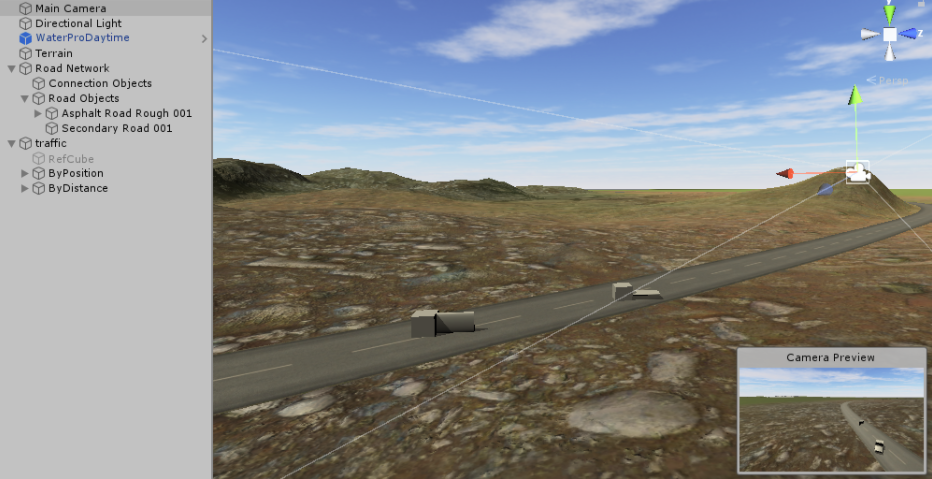
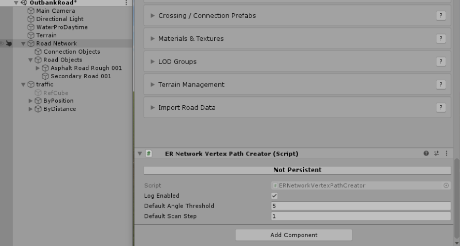
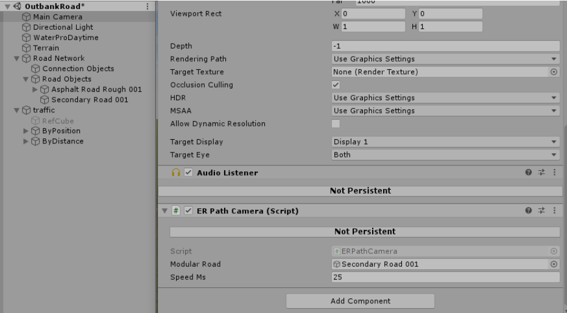
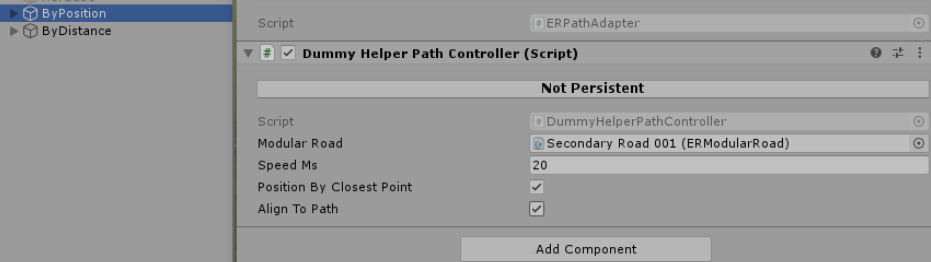
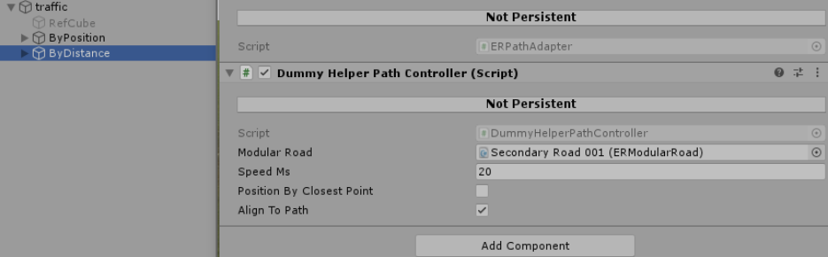
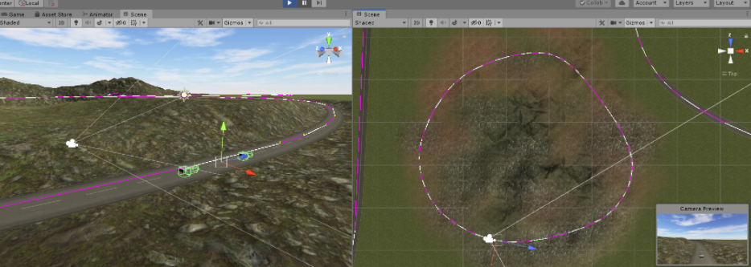

# EasyRoadsVertexPath

Here are scripts to build vertex paths for EasyRoads3d spline road paths, including sample scripts to implement path following.

**EasyRoads3D**: https://assetstore.unity.com/packages/tools/terrain/easyroads3d-pro-v3-469

Inspired by API of **Bezier Path Creator**: https://assetstore.unity.com/packages/tools/utilities/b-zier-path-creator-136082 

## How to use
1. Add `ERNetworkVertexPathCreator` to ER Road Network
	It will add (if not exists) `ERNetworkVertexPathCreator` and `ERPathAdapter` to any `ERModularRoad` from children.
	`ERNetworkVertexPathCreator` will create vertex path based on ER spline path with given `angleThreshold` and `scanStep`
	`ERPathAdapter` will provide API to align objects along the path and calculate nearest position and distance.
2. Add `ERPathCamera` (sample script) to any `Camera` to follow given road path (link `modularRoad` to any `ERModularRoad`)  
	**Input**:
	- ERModularRoad - road to follow (will search for ERPathAdapter component and use it)
	- SpeedMs - velocity in meters per second
3. Add DummyHelperPathController (another sample script) to any object to move it along the path
	Input:
	`ERModularRoad` - road object to follow
	`speedMs` - move velocity in m/s
	`positionByClosestPoint` - position object by closest point or by closest distance
	`alignToPath` - enable/disable path following (useful to check path alignment for objects out of path in different configs)

## Description of sample scene
Lets review sample config - it will contain single ER Road Network with Road, Camera to move along the Road and two GameObjects 
which will also move along road path.

 

Required config steps are described by following screenshots

1. Add `ERNetworkVertexPathCreator` to Road Network
 

2. Add `ERPathCamera` to `Camera` and link it to `ERModularRoad`
 

3. Configure `ByPosition` path follower

4. Configure `ByDistance` path follower

Vertex paths gizmos are shown in Play mode:

## Scripts
1. `ERNetworkVertexPathCreator` - scan Road Network for roads, attach `ERPathToVertexPathWrapper` and `ERPathAdapter` to each road (if not exists)
2. `ERPathToVertexPathWrapper` - builds vertex path from ER spline path for given road (by default with `angleThreshold` and `scanStep` set for ERNetworkVertexPathCreator). If `angleThreshold` or `scanStep` must be customized, `ERNetworkVertexPathCreator` can be manually attached to the road
3. `ERPathAdapter` - provide API to follow vertex path

## API methods of `ERPathAdapter`
- `Vector3 GetPointAtDistance(float distance)`
- `Quaternion GetRotationAtDistance(float distance)`
- `Vector3 GetDirectionAtDistance(float distance)`
- `float GetClosestDistanceAlongPath(Vector3 p)`
- `Vector3 GetClosestPointOnPath(Vector3 p, out float closestDistance)`
- `Vector3 GetClosestPointOnPath(Vector3 p)`

## Notes:
- I'm not using crossings, therefore linked roads are not supported
- All methods distance-related methods are map distance to current road bounds (from zero to total path distance) so you can use negative distance or distance much more than total road length
